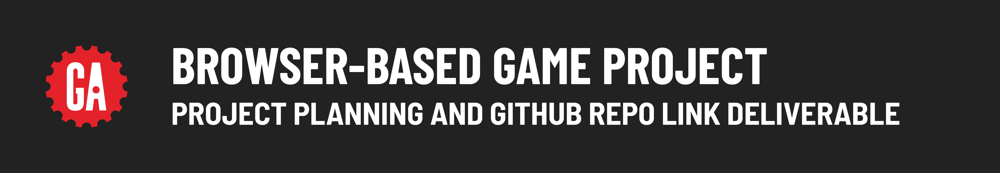

# 

## Contents

**Deliverable details**:

- Project planning deliverables
- GitHub repo deliverable

**Submitting deliverables**:

- Submitting your deliverables

## Project planning deliverables

Planning is vital to build anything more than the most trivial of applications; therefore, this is where you will begin your journey with this project. You shouldn't write any code or set up a GitHub repo for your project until an instructor approves your planning materials.

### Details

You will submit the following details about your project for approval by your instructor:

- Your choice of game.
- Pseudocode for the overall gameplay. This pseudocode does not need to go into exhaustive detail but should demonstrate that you understand some of the unique challenges you will encounter while building your game. 
- Detailed README.md (Project Title, Description, How to Get Started, Credits).
- A Trello Board detailing the plan and progress of your project.
- A wireframe of your "main" game screen. Online tools you can use to create your wireframe include [Draw.io](https://app.diagrams.net/), [Figma](https://www.figma.com/) and [Wireframe.CC](https://wireframe.cc/).
- Any additional project planning requirements specific to the game you have chosen as defined in the in the **Additional Planning Requirements** column of the table in the **[Recommended games](./recommended-games/README.md)** document or as discussed with your instructor.
- **Your game must be approved by the instructors before you begin your project.**

## GitHub repo deliverable

After your project proposal has been approved, you'll need to set up a GitHub repo for your project.

> 🚨 As a reminder, you should use the same repo or keep all the repos you use for the entire duration of your project to meet the project requirements.

## Submitting your deliverables

Follow the guidelines below to submit your deliverables for this project.

### Submitting your planning materials

Submit your planning materials below in the following format:

```plaintext
Trello Board: <link>
Wireframe: <link>
Pseudocode: <details>
```

Replacing both `<link>` and `<details>` (including the `<` and `>`) with the required links/details to complete your project planning.

### Submitting your GitHub repo link

Submit a link to the ***public*** GitHub repo that you are using for your Browser-Based Game Project below in the following format:

```plaintext
GitHub repo link: <link>
```

Replacing `<link>` (including the `<` and `>`) with a link to your GitHub repo.

Upon approval, ensure you include any links or information related to your project planning materials within your Github repo.
